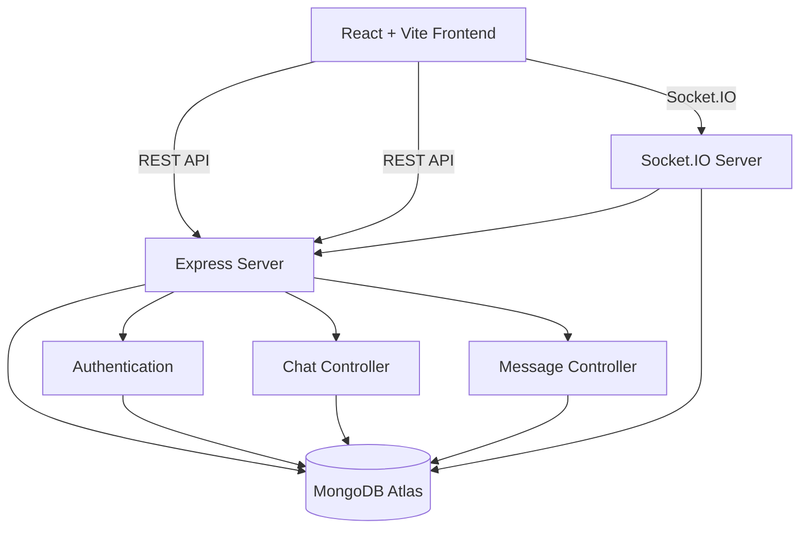

<div align="center">
  
# Chatverse — Real-Time Chat Application
</div>
 
<div align="center">
  


 
**A full-stack real-time messaging platform built on the MERN stack with Socket.IO — instant message delivery, JWT-secured sessions, and a clean responsive UI.**
 
</div>

---

## 📋 Table of Contents

* 🌐 Live Demo
* 🏗️ Architecture
* ✨ Features
* 🛠️ Tech Stack
* ⚡ Quick Start
* 🔧 Installation
* 📂 Project Structure
* 🔐 Environment Variables
* 📖 Usage
* 🔄 Real-Time Communication
* 🚀 Deployment
* 🧪 Future Improvements

---

## 🌐 Live Demo

📺 Live Link: [Chatverse](https://chatverse-real-time-app.vercel.app)

---

## 🏗️ Architecture



---

## ✨ Features

* 🔐 JWT-based authentication
* 👤 User registration and login
* 💬 One-to-one real-time messaging
* ⚡ Socket.IO powered instant communication
* 📡 Live message synchronization
* 📱 Responsive UI for desktop and mobile
* 🛡️ Secure backend APIs
* 🌐 Full-stack MERN architecture
* ☁️ Cloud deployment using Render and Vercel
* 🟢 Online/offline user presence
* 🔑 Persistent authentication

---

## 🛠️ Tech Stack

### 🎨 Frontend

<div>


</div>

### ⚙️ Backend

<div>


</div>

### 🗄️ Database

<div>


</div>

### 🚀 Deployment

<div>


</div>

---

## ⚡ Quick Start

### 📦 **Installation**

```bash
# Clone the repository
git clone https://github.com/Jyoti520/chatverse.git
cd chatverse

# Install backend dependencies
cd server
npm install

# Install frontend dependencies
cd ../client
npm install
```

---

### 📁 **Project Structure**

```
chatverse/
├── 📁 client/
│   ├── 📁 src/
|   |   ├── 📁 assets/            # Logo , Images
│   │   ├── 📁 components/        # Reusable UI components
│   │   ├── 📁 context/           # React context — auth & socket state
│   │   ├── 📁 hooks/             # Custom React hooks
│   │   ├── 📁 pages/             # Route-level page views
│   │   └── 📁 services/          # Axios api functions
│   ├── 📁 public/
|   ├── 📁 App.jsx/
|   ├── 📁 main.jsx/
│   └── 📄 package.json
│
├── 📁 server/
│   ├── 📁 config/               # DB connection & environment config
│   ├── 📁 controllers/          # Request handler logic
│   ├── 📁 middlewares/          # Auth guards & error handling
│   ├── 📁 models/               # Mongoose schemas (User, Chat, Message)
│   ├── 📁 routes/               # Express route definitions
│   ├── 📁 test/                 # Unit & integration tests
│   ├── 📄 index.js              # App entry point & Socket.IO init
│   └── 📄 package.json
│
└── 📄 README.md
```

---

## 🔐 Environment Variables

### Server

```env
PORT=
MONGO_URI=
JWT_SECRET=
CLIENT_URL=
NODE_ENV=production
```

### Client

```env
VITE_API_URL=
```

---

## 📖 Usage

1. **Register** — Create a new account with a unique username and password
2. **Automatic Authentication** — After successful registration, the user is automatically signed in and redirected to the chat interface.
3. **Log In** —You can also login and Authenticate securely and receive a JWT session token
4. **Open Contacts** — Toggle the contacts panel to browse all users
5. **Start a Chat** — Select any user to open a private conversation
6. **Send Messages** — Type and send — delivery is instant via Socket.IO
7. **Stay Live** — Messages sync in real time across all active sessions
8. **Return Later** — Existing users can log in again to continue their conversations.


---

## 🔄 Real-Time Communication

* Socket.IO establishes persistent client-server connections.
* Connected users receive new messages without page refreshes.
* Message updates propagate instantly across active sessions.

---

## 🚀 Deployment

### 🌐 **Frontend — Vercel**

```bash
# Install Vercel CLI and deploy
npm install -g vercel
cd client
vercel --prod
```

Add to Vercel dashboard environment:
```env
VITE_API_URL=https://your-render-backend.onrender.com
```

### 🖥️ **Backend — Render**

1. Connect your GitHub repo to [Render](https://render.com)
2. Set **Root Directory** → `server`
3. Set **Start Command** → `npm start`
4. Add all server environment variables in the Render dashboard

### 🗄️ **Database — MongoDB Atlas**

1. Create a free cluster at [MongoDB Atlas](https://www.mongodb.com/atlas)
2. Whitelist `0.0.0.0/0` under Network Access for Render's dynamic IPs
3. Copy your connection string into `MONGO_URI`


---

## 🧪 Future Improvements


- 👤 Profile updates
- 🖼️ Media sharing
- 🔔 Push notifications
- 📞 Voice & video calls
- 🔒 End-to-end encryption
- 🔍 Message search

---

<div align="center">

**💬 Designed to demonstrate scalable real-time communication with the MERN stack and Socket.IO.**

If you like this project, consider giving it a ⭐

[⭐ Star this repository](https://github.com/Jyoti520/Chatverse)

</div>
